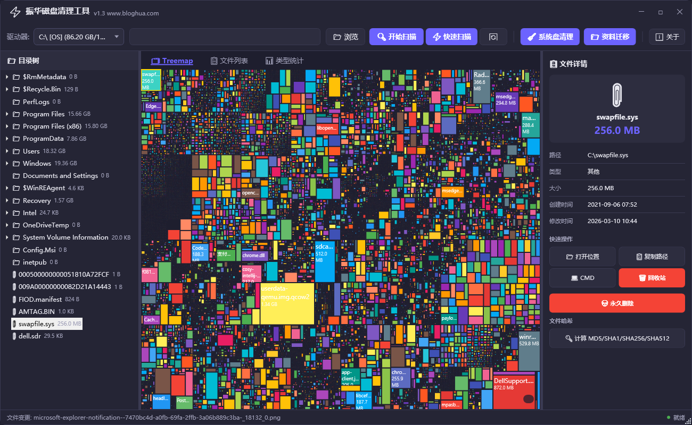
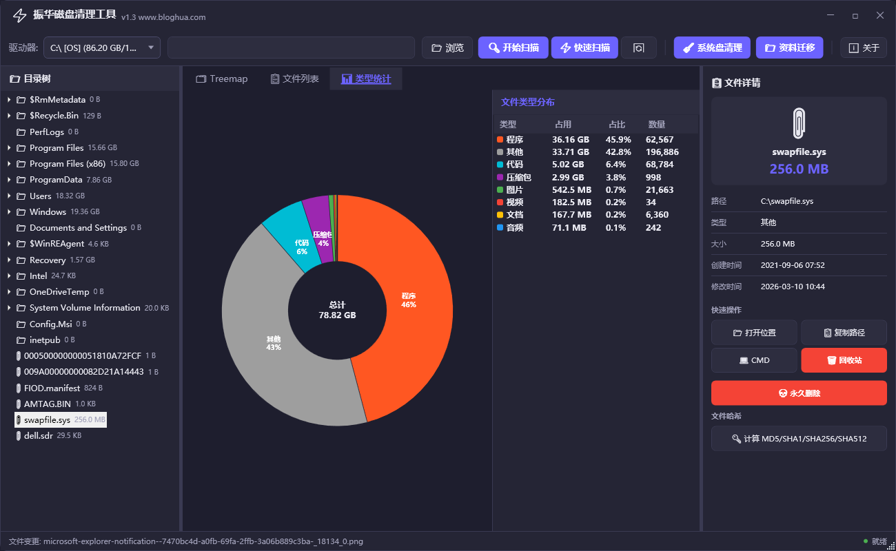
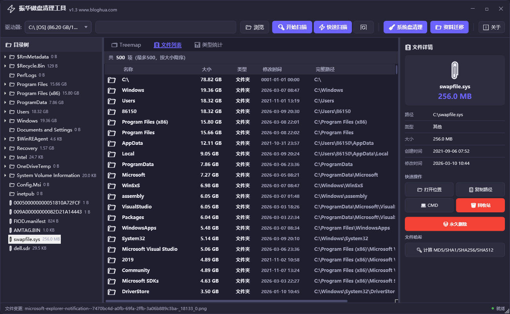
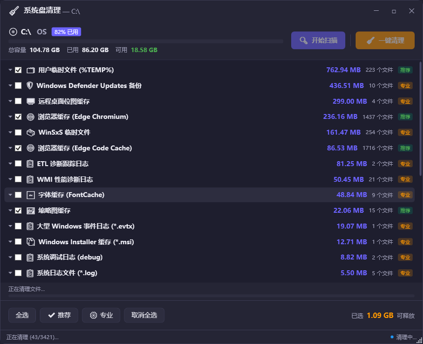

# 振华磁盘清理工具

<div align="center">

**专业级 Windows 磁盘空间分析、垃圾清理与用户资料迁移工具**

[](https://www.microsoft.com/windows)
[](https://dotnet.microsoft.com)
[](LICENSE)
[](https://diskcleaner.bloghua.com)

🌐 官网：[diskcleaner.bloghua.com](https://diskcleaner.bloghua.com)　　📧 邮箱：qyhua0@hotmail.com

</div>

---

## 简介

振华磁盘清理工具是一款基于 **WPF / .NET 8** 开发的 Windows 桌面应用，集磁盘空间可视化分析、系统垃圾清理、用户资料盘迁移三大核心功能于一体。采用深色主题、无边框设计，界面简洁专业，适合个人用户和企业 IT 运维场景。

---

## 功能模块

### 一、磁盘空间分析（主界面）








#### 扫描引擎
- 支持任意驱动器或自定义目录扫描
- **标准扫描**：多线程并行（最大 4 线程），适用所有文件系统
- **快速扫描（⚡）**：读取 NTFS MFT（主文件表），速度提升 3~5 倍，需管理员权限
- 实时进度：文件数、已扫描大小、耗时、当前路径

#### Treemap 可视化
- Squarified Treemap 算法，矩形面积与文件大小精确成比例
- 按文件类型颜色编码（图片=绿、视频=红、音频=蓝、文档=黄等 8 类）
- 鼠标悬停显示详情提示，与目录树**双向联动**
- 图例显示各类型占比

#### 文件列表 & 统计
- 按大小降序排列，一键定位磁盘占用最大的文件
- 文件类型饼图（甜甜圈样式）：分类占比、文件数量
- 显示字段：名称、大小、类型、修改时间、完整路径

#### 文件快速操作
| 操作 | 说明 |
|------|------|
| 🗑 删除到回收站 | 可撤销的安全删除 |
| 💀 永久删除 | 带确认提示，不可撤销 |
| 🧹 清空文件夹 | 删除目录内全部内容（保留目录本身） |
| 📂 打开位置 | 在资源管理器中定位 |
| 📋 复制路径 | 路径复制到剪贴板 |
| 💻 CMD 打开 | 在命令提示符中进入该目录 |
| 🔑 计算哈希 | 一键并行计算 MD5 / SHA1 / SHA256 / SHA512 |

#### 实时监控
- `FileSystemWatcher` 持续监控扫描目录，文件增删时自动提示

---

### 二、系统盘清理（🧹 系统清理）




专为清理 **C 盘垃圾文件**设计的独立模块，规则驱动、安全可靠。

#### 清理规则体系
- 内置 **87 条**清理规则，分两档：
  - **推荐清理**（24 条）：Windows 临时文件、回收站残留、系统日志、崩溃转储、更新缓存等
  - **专业清理**（63 条）：各大软件缓存（微信、Chrome、Edge、VS、npm、pip 等）、缩略图缓存、字体缓存、搜索索引等
- 规则存储于 `rules.json`，可自行扩展添加自定义规则

#### 扫描与清理流程

```
选择清理规则 → 并行扫描 → 勾选文件 → 安全清理 → 查看结果
```

1. 按规则并行扫描 C 盘，实时展示每条规则发现的文件数和大小
2. 每个规则可独立勾选，精确控制清理范围
3. 清理前对文件分级处理：
   - **SYSTEM 权限文件** → 标记跳过，不强制删除
   - **进程占用文件** → 注册重启删除（`MoveFileEx` + `PendingFileRenameOperations`）
   - **普通文件** → 立即删除，二次确认防误删
4. 清理完成显示：释放空间大小、成功 / 跳过 / 重启删除 各项数量

#### 安全机制
- `SHFileOperation` 返回值校验 + `File.Exists` 二次确认，防止误报
- 自动跳过系统关键路径（`System32`、注册表文件等）

---

### 三、个人资料迁移（📁 资料迁移）


将 C 盘用户文件夹（桌面、文档、下载等）**安全迁移到其他分区**，彻底释放系统盘空间，同时自动更新 Windows 注册表路径指向，无需手动配置。

#### 支持迁移的文件夹

| 图标 | 名称 | 注册表键 |
|------|------|----------|
| 🖥 | 桌面 | `Desktop` |
| 📄 | 文档 | `Personal` |
| ⬇ | 下载 | `{374DE290-123F-4565-9164-39C4925E467B}` |
| 🖼 | 图片 | `My Pictures` |
| 🎵 | 音乐 | `My Music` |
| 🎬 | 视频 | `My Videos` |
| ⭐ | 收藏夹 | `Favorites` |

#### 迁移流程

```
扫描文件夹 → 选择目标磁盘 → 预检验证 → robocopy 复制 → 注册表重定向 → 验证 → 可选删除源目录
```

**详细步骤：**

1. **扫描**：从注册表 `Shell Folders` 读取各文件夹真实路径，并行异步计算大小（逐目录容错，无权限子目录自动跳过）
2. **目标盘选择**：自动排除源盘防止误操作，显示目标盘可用空间
3. **预检（Preflight）**：
   - ✗ 路径为空 / 与源相同 / 是源的子目录 → 阻止迁移
   - ✗ 目标盘空间不足（需 ≥ 源大小 × 1.2）→ 阻止迁移
   - ⚠ 目标目录已存在且非空 → 警告提示，用户确认后继续
4. **复制**：`robocopy /E /COPY:DAT /R:1 /W:1`，仅复制数据、属性、时间戳（跳过 ACL 避免权限报错），退出码 ≥ 32 才视为真正错误
5. **注册表重定向**：同时写入 `User Shell Folders`（ExpandString，持久）和 `Shell Folders`（String，当前会话即时生效），并调用 `SHSetKnownFolderPath` 通知 Shell 刷新
6. **验证**：回读注册表确认写入成功
7. **删除源目录**（可选）：迁移完成后弹窗询问，逐文件递归删除（去只读属性、跳过被占用文件、非空目录自动保留）
8. **回滚**：任何步骤失败，自动将注册表恢复为原路径

#### 进度显示
- 双进度条：**总体进度**（平滑实时推进，基于文件夹内复制进度折算）+ **当前文件夹进度**
- 带呼吸动画的状态指示点（迁移中紫色闪烁）
- 完整操作日志，可导出为 `.txt`

#### 安全特性
- 源路径可点击（链接样式），迁移前方便直接打开核查
- 目标路径实时校验（绿色 ✓ / 红色 ✗ + 错误说明）
- 迁移中禁用所有交互控件，防止误操作
- 已迁移文件夹显示绿色「✔ 已迁移」徽章，复选框自动禁用


## 项目结构

```
ZhenhuaDiskCleaner/
│
├── Models/                          # 主模块数据模型
│   ├── FileNode.cs                  # 文件/目录节点
│   ├── ScanProgress.cs              # 扫描进度
│   └── TreemapNode.cs               # Treemap 节点
│
├── ViewModels/
│   └── MainViewModel.cs             # 主窗口 ViewModel
│
├── Views/
│   ├── MainWindow.xaml              # 主窗口界面
│   └── MainWindow.xaml.cs
│
├── Services/                        # 主模块服务
│   ├── DiskScannerService.cs        # 磁盘扫描（多线程 / NTFS MFT）
│   ├── FileClassifier.cs            # 文件类型分类
│   ├── FileOperationService.cs      # 文件操作（删除/哈希/CMD）
│   └── FileWatcherService.cs        # 实时文件系统监控
│
├── Controls/
│   └── TreemapControl.cs            # Treemap 自定义控件
│
├── Helpers/
│   └── TreemapAlgorithm.cs          # Squarified Treemap 算法
│
├── Converters/
│   └── ValueConverters.cs           # WPF 值转换器
│
├── Themes/
│   └── DarkTheme.xaml               # 全局深色主题（全控件重写 Template）
│
├── CleanerModule/                   # ── 系统盘清理模块（完全独立）──
│   ├── Models/
│   │   ├── ScanResult.cs            # 扫描结果
│   │   └── ScanRule.cs              # 规则定义
│   ├── Services/
│   │   ├── CleanerService.cs        # 清理执行（文件删除 / 重启删除）
│   │   ├── DiskInfoService.cs       # 磁盘信息
│   │   ├── RuleLoader.cs            # 规则加载（rules.json）
│   │   └── ScannerService.cs        # 规则匹配扫描
│   ├── ViewModels/
│   │   └── CleanerViewModel.cs
│   ├── Views/
│   │   ├── CleanerWindow.xaml
│   │   └── CleanerWindow.xaml.cs
│   └── Resources/
│       └── rules.json               # 87 条清理规则配置
│
├── MigratorModule/                  # ── 个人资料迁移模块（完全独立）──
│   ├── Models/
│   │   ├── FolderItem.cs            # 可迁移文件夹模型
│   │   └── MigrationModels.cs       # 迁移结果 / 日志条目
│   ├── Services/
│   │   ├── FolderScanService.cs     # 注册表读取 + 大小计算
│   │   └── MigrationService.cs      # robocopy + 注册表重定向 + 删源
│   ├── ViewModels/
│   │   └── MigratorViewModel.cs
│   └── Views/
│       ├── MigratorWindow.xaml
│       └── MigratorWindow.xaml.cs
│
├── App.xaml                         # 应用入口 + 主题资源合并
├── App.xaml.cs
└── ZhenhuaDiskCleaner.csproj        # 项目文件（.NET 8 WPF）
```

---

## 依赖包

| 包名 | 版本 | 用途 |
|------|------|------|
| `CommunityToolkit.Mvvm` | 8.2.2 | MVVM 框架（ObservableObject、RelayCommand、源生成器） |

---

## 技术要点

| 方向 | 实现 |
|------|------|
| 架构模式 | MVVM，三模块完全独立，禁止跨模块引用 |
| UI 渲染 | 无边框圆角窗口，全套控件 Template 重写（Button / ComboBox / ScrollBar 等） |
| 扫描性能 | 多线程并行 + NTFS MFT 直读（快速扫描模式） |
| Treemap | Squarified 算法（DrawingVisual 低层渲染，性能优先） |
| 饼图 | Canvas + StreamGeometry 手绘甜甜圈图 |
| 文件哈希 | `Task.WhenAll` 并行计算四种哈希 |
| 清理安全 | SHFileOperation 校验 + File.Exists 二次确认 + MoveFileEx 重启删除 |
| 迁移复制 | robocopy 错误码 bit flags 解析（≥32 才报错），复制完成后统计目标目录实际大小 |
| 注册表迁移 | 双写 User Shell Folders（持久）+ Shell Folders（当前会话）+ SHSetKnownFolderPath |
| 文件夹选择 | 纯 Win32 P/Invoke：SHBrowseForFolder / SHGetPathFromIDList / CoTaskMemFree |
| 权限处理 | 无权限目录逐级跳过；系统文件分级处理（跳过 / 重启删除） |

---

## 许可证

GPL License © 2026 https://bloghua.com All rights reserved.


---

<div align="center">
如有问题或建议，欢迎访问 <a href="https://diskcleaner.bloghua.com">官网</a> 或发送邮件至 support@bloghua.com
</div>
